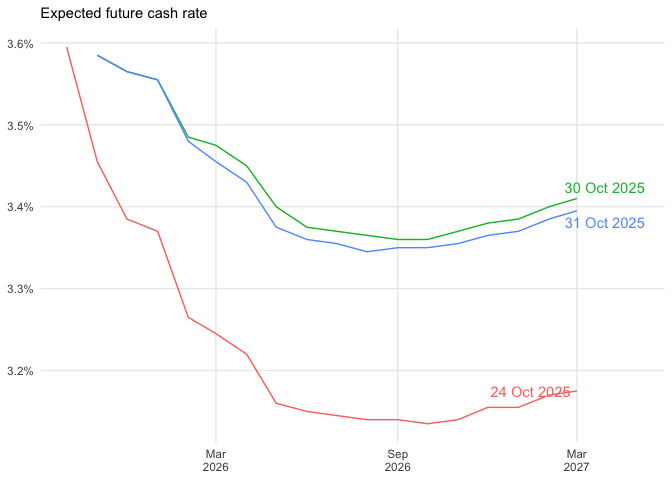
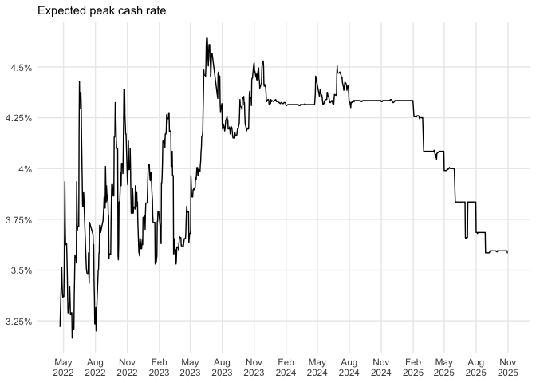
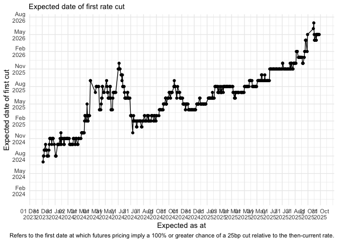

<!-- README.md is generated from README.Rmd. Please edit that file -->

# cash-rate-scraper

The key script in this repo is `R/scrape_cash_rate.R`. This file parses
market expectations for the cash rate based on the [latest ASX cash rate
implied yield
curve](https://www.asx.com.au/markets/trade-our-derivatives-market/futures-market/rba-rate-tracker).

The data is saved as a CSV in `daily_data`. The file
`combined_data/all_data.Rds` contains a dataframe that is the
combination of all the daily data CSVs.

Note that there was a gap in the data collection between 1 July and 20
July, as the ASX changed its website.

I offer no assurance that this will continue to work, or that the data
extracted using this script will be free of errors.

The `.github/workflows/refresh_data.yaml` file contains the instructions
to GitHub Actions to tell it to run `scrape_cash_rate.R` each day and
commit the results in this repo.

Please fork/copy/modify as you see fit.

# Graphs!

The file `R/viz_cash_rate.R` produces visualisations of this data, which
are shown below:

<!-- --><!-- --><!-- --><!-- -->

    #> Warning: Removed 126 rows containing missing values or values outside the scale range
    #> (`geom_point()`).
    #> Warning: Removed 126 rows containing missing values or values outside the scale range
    #> (`geom_line()`).

<!-- -->
