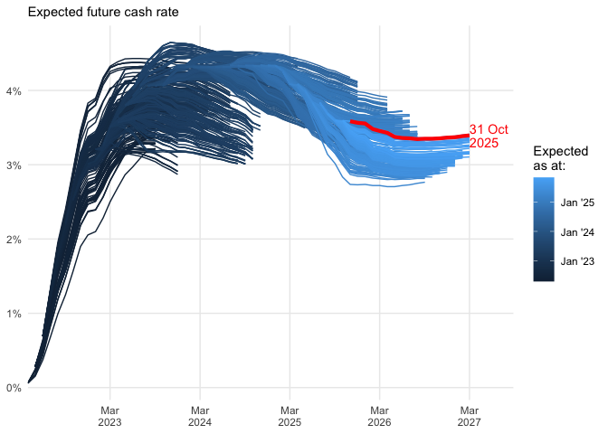

<!-- README.md is generated from README.Rmd. Please edit that file -->

# cash-rate-scraper

This repository was created for demonstration purposes.

It contains one script: `R/scrape_cash_rate.R`. This file downloads the
[latest ASX cash rate implied yield curve
PDF](https://www.asx.com.au/data/trt/ib_expectation_curve_graph.pdf),
and attempts to parse the table from the PDF. The table is saved as a
CSV in `daily_data`. The file `combined_data/all_data.Rds` contains a
dataframe that is the combination of all the daily data CSVs.

Note that this script is brittle and was hacked together quickly. It
will probably break\! I offer no assurance that this will continue to
work, or that the data extracted using this script will be free of
errors.

The `.github/workflows/refresh_data.yaml` file contains the instructions
to GitHub Actions to tell it to run `scrape_cash_rate.R` each day and
commit the results in this repo.

Please fork/copy/modify as you see fit.

# Graph\!

    #> Warning: Removed 16 row(s) containing missing values (geom_path).

<!-- -->
